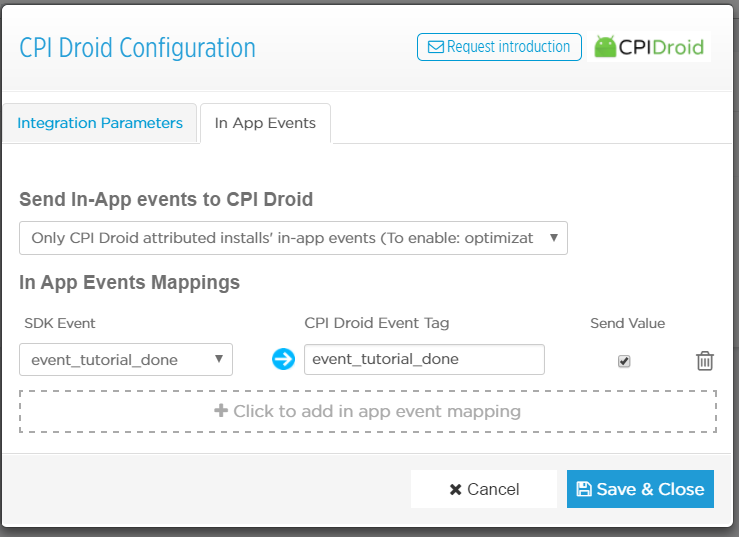

# Configuring In-App-Events for CPA Campaign

In order for CPA campaign to work correctly, you may have to adjust some additional settings to make sure event postbacks are enable and correctly configured to fired upon each time the target action is completed by the end user, you can easily enable this from your respective tracking provider's dashboard. We have outlined quick steps for some of the popular tracking providers below:-

&#x20;

### For Appsflyer:

1. Please log in to your Appsflyer dashboard, select your app, and go to "Integrated Partners" in the navigation on the left. Search & locate for CPI Droid, open the tab/pop-up/window. Next, go to the "Integration" tab and enable "In App Events" postbacks.\
   &#xNAN;_&#x4E;ote: Assuming you have already activated "CPI Droid" as your partner and enabled "Default" postbacks._

<figure><figcaption></figcaption></figure>

_Note: This image is from Appsflyer's old UI_

1. **SDK Event Name** : Select the appropriate in-app event you would like to use for the campaign, copy the event name in to the "Partner Event Identifier" field, select "Send Value" and hit "Save & Close".\
   &#xNAN;_&#x4E;ote: We will track the same event to count successful conversion._
2. **Partner Event Identifier** : It's should be same as what you have provided as your even name while creating CPA campaign on our platform.
3. **Sending Option** : "This partner only"
4. **Send Revenue** : "Values & revenue"
5. Don't forget to "Save" the integration.

Kindly refer these official articles from appsflyer for detailed explanation about In-App-Events:-

* [https://support.appsflyer.com/hc/en-us/articles/207031986-In-App-Events-Overview](https://support.appsflyer.com/hc/en-us/articles/207031986-In-App-Events-Overview)
* [https://support.appsflyer.com/hc/en-us/articles/207032186-AppsFlyer-Rich-In-App-Events-Android](https://support.appsflyer.com/hc/en-us/articles/207032186-AppsFlyer-Rich-In-App-Events-Android)
* [https://support.appsflyer.com/hc/en-us/articles/208439256-In-App-Events-Postback-Configuration](https://support.appsflyer.com/hc/en-us/articles/208439256-In-App-Events-Postback-Configuration)
