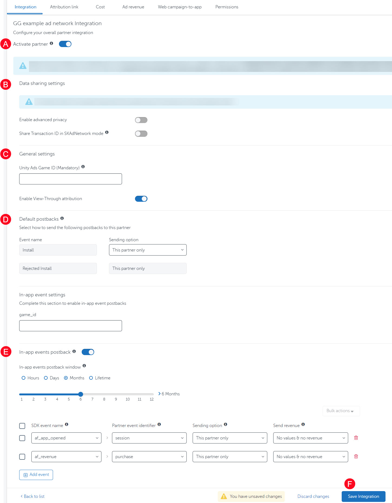

# Appsflyer

**About Appsflyer Tracking / SDK**

Appsflyer is a 3rd party tracking solution that provides tracking SDK and the purpose of tracking SDK is to track installs or conversions, report it to Appsflyer data center, then they verify the same and send a conversion postback to our server.

If you integrated the Appsflyer tracking SDK into your app, you can use Appsflyer as a tracking solution. This allows you to rely on Appsflyers reporting and their anti-fraud measures. Additionally, you can create and run CPA campaigns in this setup. Please make sure to enable sending in-app events in your Appsflyer dashboard in case you create a CPA campaign with us. Please keep in mind that Appsflyer will charge you an additional fee per install for their services. \
\
New to Appsflyer? Kindly refer to this official step by step guide by Appsflyer => [Getting Started: Step-by-Step](https://support.appsflyer.com/hc/en-us/articles/207033486-Getting-Started-Step-by-Step)

**Overview:**

1. [Integrate AppsFlyer SDK:](appsflyer.md#h_01eqfg4hhw715m3j7edfvj72mv)
2. [Initialize SDK & Test Integration:](appsflyer.md#h_01ex23b9q71swqry0798545av2)
3. [Activate CPIDroid as Partner:](appsflyer.md#id-3.-activate-cpidroid-as-partner)
4. [Enable Install/Event Postbacks:](appsflyer.md#h_01eqfg4wh0d5drf2takprfcqtm)
5. [Grab your Tracking Link:](appsflyer.md#h_01exkg6xemvz115jrksz6c3r10)

### 1. Integrate AppsFlyer SDK: 

You may need to integrate Appsflyer tracking SDK which is required for iOS CPI campaigns and you can learn more about it at [https://www.appsflyer.com](https://www.appsflyer.com/) or refer to the official articles from Appsflyer help center as given below:-

* [AppsFlyer SDK Integration - Android](https://support.appsflyer.com/hc/en-us/articles/207032126-AppsFlyer-SDK-Integration-Android)
* [AppsFlyer SDK Integration - iOS](https://support.appsflyer.com/hc/en-us/articles/207032066-AppsFlyer-SDK-Integration-iOS)\
  \- **Make sure to implement ATT Prompt** => [https://support.appsflyer.com/hc/en-us/articles/207032066-AppsFlyer-SDK-Integration-iOS#configure-app-tracking-transparency-att-support](https://support.appsflyer.com/hc/en-us/articles/207032066-AppsFlyer-SDK-Integration-iOS#configure-app-tracking-transparency-att-support) \[**IMPORTANT for iOS**]\
  \- **Make sure to disable Aggregated Advanced Privacy** => [https://support.appsflyer.com/hc/en-us/articles/360018515798-Aggregated-Advanced-Privacy-framework#controlling-aap](https://support.appsflyer.com/hc/en-us/articles/360018515798-Aggregated-Advanced-Privacy-framework#controlling-aap) \[**IMPORTANT for iOS**]\
  \- Learn more about [iOS 14 Advanced Privacy & Tracking](https://thesmartware.zendesk.com/hc/en-us/articles/360058630912-iOS-14-Advanced-Privacy-Tracking)

**NOTICE:** For any technical support, please drop mail at [support@appsflyer.com](mailto:support@appsflyer.com?subject=I%20Need%20Help%20in%20Integrating%20Appsflyer%20SDK%20for%20CPI%20Droid%20\(https%3A%2F%2Fcpidroid.com\)\&body=Hi%20Team%2C%0AKindly%20guide%20me%20with%20the%20integration%20process%20for%20Appsflyer%20SDK%20and%20the%20tracking%20details%20required%20to%20setup%20campaign%20at%20CPI%20Droid%20\(https%3A%2F%2Fcpidroid.com\)%20with%20Appsflyer%20tracking.)

### 2. Initialize SDK & Test Integration: 

* Testing basic SDK functionality : [https://support.appsflyer.com/hc/en-us/articles/360001559405-Testing-AppsFlyer-SDK-integration#testing-basic-sdk-functionality](https://support.appsflyer.com/hc/en-us/articles/360001559405-Testing-AppsFlyer-SDK-integration#testing-basic-sdk-functionality)&#x20;
* Testing using attribution links : [https://support.appsflyer.com/hc/en-us/articles/360001559405-Testing-AppsFlyer-SDK-integration#testing-using-attribution-links](https://support.appsflyer.com/hc/en-us/articles/360001559405-Testing-AppsFlyer-SDK-integration#testing-using-attribution-links)&#x20;

\*It is highly recommended that you initialize the SDK and test the integration beforehand.

**NOTICE:** For any technical support, please drop mail at [support@appsflyer.com](mailto:support@appsflyer.com?subject=I%20Need%20Help%20in%20Integrating%20Appsflyer%20SDK%20for%20CPI%20Droid%20\(https%3A%2F%2Fcpidroid.com\)\&body=Hi%20Team%2C%0AKindly%20guide%20me%20with%20the%20integration%20process%20for%20Appsflyer%20SDK%20and%20the%20tracking%20details%20required%20to%20setup%20campaign%20at%20CPI%20Droid%20\(https%3A%2F%2Fcpidroid.com\)%20with%20Appsflyer%20tracking.)

### 3. Activate CPIDroid as Partner:

* In AppsFlyer, go to **Configuration** > **Integrated Partners**. Select "CPIDroid" as your Integrated partner.

<figure><figcaption>
 
</figcaption></figure>

* Activate us (cpidroid\_int) as partner : [https://support.appsflyer.com/hc/en-us/articles/207033816#partner-setup-a-6](https://support.appsflyer.com/hc/en-us/articles/207033816#partner-setup-a-6) \[Refer (A) in above image]
* **For iOS Only:** Please implement ATT prompt or keep Advanced Privacy disabled \[Refer (B) in above image] for tracking to work properly (**IMPORTANT**) - [Learn more](https://support.appsflyer.com/hc/en-us/articles/207032066-AppsFlyer-SDK-Integration-iOS#configure-app-tracking-transparency-att-support)

### 4. Enable Install/Event Postbacks: 

* Enable Default Postback : [https://support.appsflyer.com/hc/en-us/articles/207033816#partner-setup-d-9](https://support.appsflyer.com/hc/en-us/articles/207033816#partner-setup-d-9)&#x20;
* Enable In-App Event Postback : [https://support.appsflyer.com/hc/en-us/articles/207033816#partner-setup-e-10](https://support.appsflyer.com/hc/en-us/articles/207033816#partner-setup-e-10) (required for CPA campaign)

<figure><figcaption></figcaption></figure>

* **Partner Event Identifier** : It should be same as the Even Name that you provide while creating CPA campaign at [https://app.cpidroid.com/campaign/add?platform=android](https://app.cpidroid.com/campaign/add?platform=android)&#x20;

### 5. Grab your Tracking Link: 

* Copy your Appsflyer tracking link (Click attribution link) from the **Attribution link** tab.
* Copy-paste it into "**Tracking Link**" input field while creating campaign at [https://cpidroid.com/campaign/install/add.php](https://cpidroid.com/campaign/install/add.php) after choosing Appsflyer as your "**Tracking Provider**".

**Still, facing trouble?**

* Let's try troubleshooting the tracking integration issues @ [https://thesmartware.zendesk.com/hc/en-us/articles/360035387592-Troubleshooting-Tracking-Integration-Issues](https://thesmartware.zendesk.com/hc/en-us/articles/360035387592-Troubleshooting-Tracking-Integration-Issues)&#x20;

**Need Extended Help with Appsflyer?**\
Please note that Appsflyer is 3rd party and for extended support, you may refer their:

* Help Center : [https://support.appsflyer.com](https://support.appsflyer.com/) or
* Contact AppsFlyer support via [support@appsflyer.com](mailto:support@appsflyer.com?subject=I%20Need%20Help%20in%20Integrating%20Appsflyer%20SDK%20for%20CPI%20Droid%20\(https%3A%2F%2Fcpidroid.com\)\&body=Hi%20Team%2C%0AKindly%20guide%20me%20with%20the%20integration%20process%20for%20Appsflyer%20SDK%20and%20the%20tracking%20details%20required%20to%20setup%20campaign%20at%20CPI%20Droid%20\(https%3A%2F%2Fcpidroid.com\)%20with%20Appsflyer%20tracking.) to hear officially from Appsflyer team.
